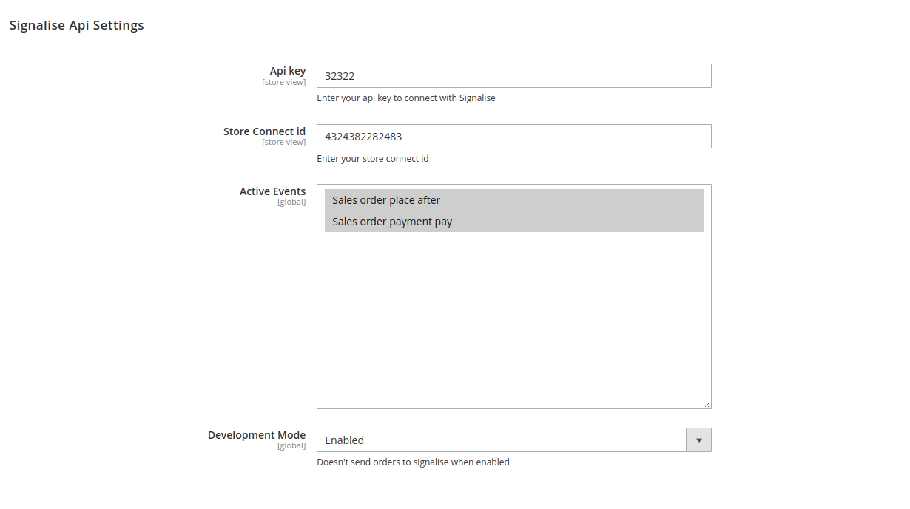

# Signalise Magento2 Plugin

Magento2 Plugin that push data to Signalise, data wil be pushed in a queue 
and a consumer will be pushing the data to Signalise.

This plugin can also push orders or a specific order to signalise through the PushOrder command.

```
signalise:push-order {order_id}
```

## Installation

In order to install this package you need composer.

```
composer require signalise/magento2-plugin
```

## Configuration

- Api key.
- Connect id (Needs to be configured for each store).
- Active Events (You can select which event you want to activate). 
- Development (When development is enabled, it is not possible to send data to signalise. However the events will be triggered and send to the queue).



## Events

We currently have 2 configurable events that will send data to signalise when it gets triggered. 

- ``sales_order_place_after`` - This event will be triggered when you place an order.
- ``sales_order_payment_pay`` - This event will be triggered when you pay after you placed an order.

> **More events will be added in the future** 

## Support

Signalise PHP Client is made by [Ndottens](https://github.com/Ndottens).

If you find a bug or want to submit an improvement, don't hesitate to create a merge request on Gitlab.
