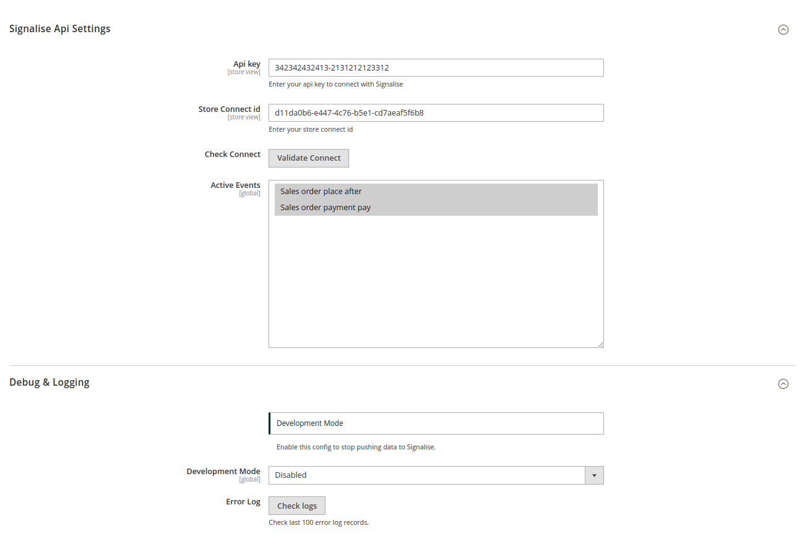

# Signalise Magento2 Plugin

Magento2 Plugin that push data to Signalise, data wil be pushed in a queue 
and a consumer will be pushing the data to Signalise.

This plugin can also push orders or a specific order to signalise through the PushOrder command.

```
signalise:push-order {order_id}
```

## Installation

In order to install this package you need composer.

```
composer require signalise/magento2-plugin
```

## Configuration

- Api key.
- Connect id (Needs to be configured for each store).
- Active Events (You can select which event you want to activate). 
- Development (When development is enabled, it is not possible to send data to signalise. However the events will be triggered and send to the queue).
- Error log (Show last 100 error records).



## Setup command

Setup console command: ``bin/magento signalise:setup``

#### Options:
- -s | --skip-credentials (Skip the url and key credentials step).
- -c | --select-store (Select the store code you want to create a connection for).

### Scenario 1:
you want to create a connection for a new store and this is the first time you installed this plugin.

- run ``bin/magento signalise:setup``
- Enter api url
- Enter Api key

This will create a connect id for the default store.

### Scenario 2:

You want to create a connect id for a specific store but you haven't set the key & url yet.

- run ``bin/magento signalise:setup -c``
- Select the store you want to create a connection for. (This wil show a select option for all stores that are created)
- Enter api url
- Enter Api key

This will create a connect id for the selected store.

### Scenario 3:

You want to create a connect id for a specific store but you already  set the key & url value.

- run ``bin/magento signalise:setup -c -s``
- Select the store you want to create a connection for. (This wil show a select option for all stores that are created)

This will create a connect id for the selected store (And you skipped the api url and api key step).

## Events

We currently have 2 configurable events that will send data to signalise when it gets triggered. 

- ``sales_order_place_after`` - This event will be triggered when you place an order.
- ``sales_order_payment_pay`` - This event will be triggered when you pay after you placed an order.

> **More events will be added in the future**

## Support

If you find a bug or want to submit an improvement, don't hesitate to create a merge request.
